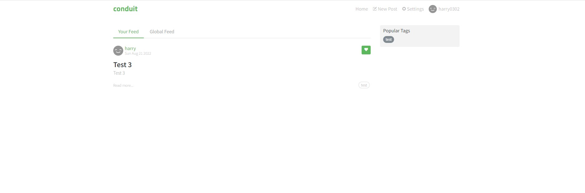
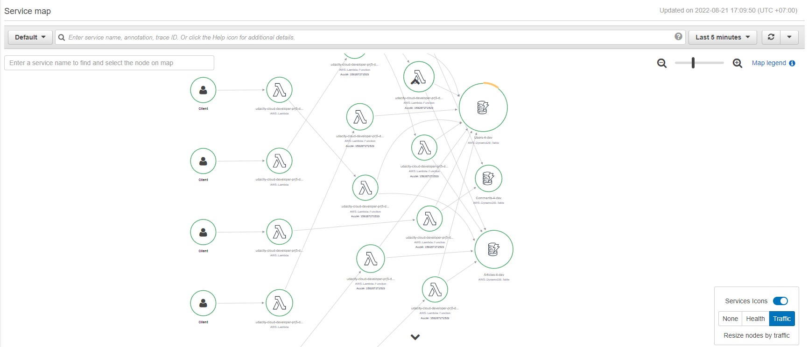
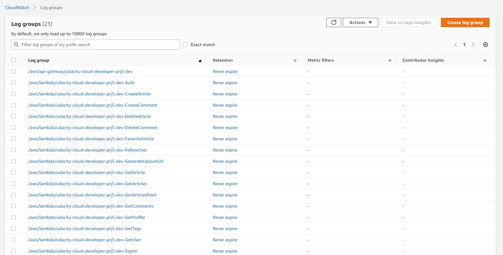
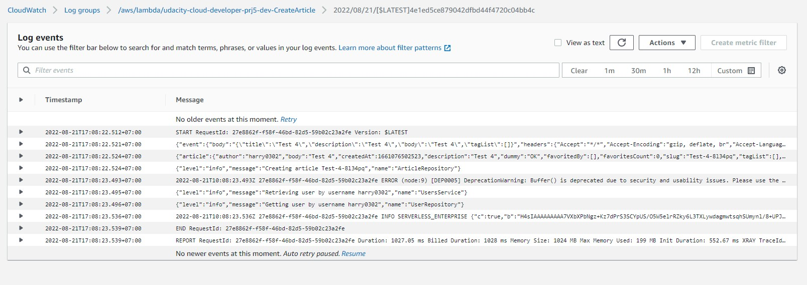

# Udacity - Cloud Developer Nanodegree Capstone Project

## Functionality of the application

The application allows creating/removing/updating/fetching article items.

<div align="center">
  
</div>

***

## Implemented functions

The following lambda functions have been implemented (and set up in serverless.yml):
- Auth: Lambda authorizer (formerly custom authorizer)
- GetArticles: retrieves all article
- GetArticle: retrieves one article (by slug)
- CreateArticle: creates a new article item
- UpdateArticle: updates a article item
- DeleteArticle: removes a article item
- GetTags: retrieves all tag
- Signin: login to already have account
- Signup: register new account
- GetCurrentUserInfo: retrieve a current user logged
- GetProfile: retrieve one user profile by username
- GetComments: retrieve all comment of one article by slug
- CreateComment: creates a new comment item
- DeleteComment: removes a comment item

All functions are already connected to appropriate events from API Gateway.
An username of a user can be extracted from a JWT token passed by a client.

***
## Frontend

The `client` folder contains a web application that can use the API that should be developed in the project. The API_ROOT binding in `agent.ts` should be set to the correct value.

```ts
const API_ROOT = '...' API Gateway URL
```

***

# How to run the application

## Backend

To deploy an application run the following commands:
export NODE_OPTIONS=--max_old_space_size=8192

```
cd backend
npm install
sls deploy -v
```

## Frontend

To run a client application first edit the `client/src/agent.ts` file to set correct parameters. And then run the following commands:

```
cd client
npm install
npm run start
```

This should start a development server with the React application that will interact with the serverless Article application.

***

# Monitoring
## Distributed tracing

X-Ray tracing has been set up

<div align="center">
  
</div>

## Logging

The starter code came with a configured [Winston](https://github.com/winstonjs/winston) logger that creates [JSON formatted](https://stackify.com/what-is-structured-logging-and-why-developers-need-it/) log statements. It is used to write log messages like this:

<div align="center">
  
</div>

```ts
import { createLogger } from '../../utils/logger'
const logger = createLogger('auth')

// You can provide additional information with every log statement
// This information can then be used to search for log statements in a log storage system
logger.info('User was authorized', {
  // Additional information stored with a log statement
  key: 'value'
})
```

<div align="center">
  
</div>

***